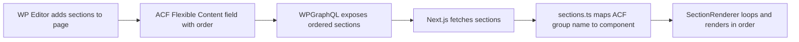
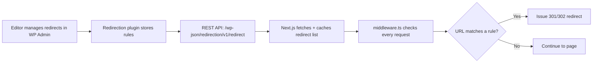

## Progress Checklist


| #   | Task                                                                     | Status |
| --- | ------------------------------------------------------------------------ | ------ |
| 1   | Environment + GraphQL client (`.env.local`, `src/lib/wordpress.ts`)      | ✅      |
| 2   | Atomic folder structure (atoms, molecules, sections, globals, templates) | ✅      |
| 3   | Self-hosted fonts + Tailwind typography                                  | ✅      |
| 4   | i18n routing (`[locale]`, middleware, `src/lib/i18n.ts`)                 | ✅      |
| 5   | Global layout components (PromoBar, UtilityBar, Header, Footer)          | ✅      |
| 6   | Section mapping registry + SectionRenderer                               | ✅      |
| 7   | GraphQL fragments (sections, Yoast, menus, globals)                      | 🔶     |
| 8   | Page data fetching (`[locale]/page.tsx`, `[...slug]/page.tsx`)           | ✅      |
| 9   | CPT routes (case-studies, resources, news)                               | ✅      |
| 10  | SEO metadata (generateMetadata, hreflang)                                | ✅      |
| 11  | Redirects system (Redirection API, middleware)                           | ✅      |
| 12  | Revalidation endpoint (`/api/revalidate`)                                | ✅      |
| 13  | Search (WPGraphQL, results page)                                         | ✅      |
| 14  | Forms (HubSpot embeds, cookie gating)                                    | ✅      |
| 15  | Cookie consent (region-aware banner)                                     | ✅      |
| 16  | Animation setup (GSAP, Lottie)                                           | 🔶     |
| 17  | Sitemap + robots.txt                                                     | ✅      |
| 18  | First atoms + sections (Button, Heading, etc.)                           | ✅      |
| 19  | Styleguide page                                                          | ✅      |
| 20  | Deployment (Docker, CI/CD)                                               | ⬜      |
| 21  | WP plugin setup (WPGraphQL, ACF, Yoast; WPML optional)                   | ⬜      |


**Note:** WPML + WPGraphQL WPML not yet installed — multilingual features deferred until added.

---

# Headless WordPress + Next.js Infrastructure Plan

## 1. WordPress Plugin Requirements (WP Admin Side)

The following plugins need to be installed/active on `kaosk10.sg-host.com`:

**Already installed:**

- **ACF Pro** — flexible content sections, options pages for global fields
- **Yoast SEO** — meta, OG, schema, breadcrumbs
- **WPML** — multilingual content management
- **Redirection** — 301/302 URL redirect management

**To install (GraphQL layer):**

- **WPGraphQL** — exposes a GraphQL API at `/graphql`
- **WPGraphQL for ACF** — exposes ACF fields in the GraphQL schema
- **WPGraphQL WPML** — adds language filtering to GraphQL queries
- **WPGraphQL for Yoast SEO** — exposes Yoast data in GraphQL

**To install (other):**

- **WP Webhooks** (or custom mu-plugin) — fires webhook to Next.js on content save for on-demand revalidation

**External service:**

- **HubSpot** — forms are embedded directly from HubSpot (contact, newsletter signup). No WP form plugin needed.

**WordPress CMS configuration needed:**

- Register Custom Post Types: Case Studies, Insights/Resources, News & Events
- Register Taxonomies: Solutions, Industries, Topics, Content Types
- Create ACF Options Pages for global fields: Promo Bar, Utility Bar, Footer, site-wide CTAs
- Configure WP Menus for the main navigation (exposed via WPGraphQL)

---

## 2. Environment Configuration

In `[.env.local](.env.local)`:

```env
WORDPRESS_GRAPHQL_URL=https://kaosk10.sg-host.com/graphql
WORDPRESS_REST_URL=https://kaosk10.sg-host.com/wp-json
REVALIDATION_SECRET=<random-secret-token>
NEXT_PUBLIC_SITE_URL=https://softco.com
```

- `[src/lib/wordpress.ts](src/lib/wordpress.ts)` — shared GraphQL client, reads from `WORDPRESS_GRAPHQL_URL`, handles all content + SEO queries with cache tags
- `[src/lib/redirects.ts](src/lib/redirects.ts)` — fetches redirect rules from the Redirection plugin REST API at `WORDPRESS_REST_URL/redirection/v1/redirect`

---

## 3. Project File Structure (Atomic Design)

```
src/
  components/
    atoms/              # Smallest UI elements
      Button/
      Heading/
      Paragraph/
      Input/
      Select/
      Checkbox/
      Image/
      Link/
      Icon/
      Badge/
    molecules/          # Combinations of atoms
      Card/
      FormField/
      NavItem/
      MediaBlock/
      AccordionItem/
      StatBlock/
      LogoStrip/
    sections/           # Full page sections (mapped 1:1 to ACF groups)
      HeroSection/
      CtaBandSection/
      WhereWeExcelSection/
      PlatformSection/
      TechFeaturesSection/
      ClientSuccessSection/
      PerfectFitSection/
      RolesSection/
      ResourcesSection/
      LogoStripSection/
      ContactHeroSection/
      LocationsSection/
      SignupSection/
      ...
    globals/            # Site-wide components (not ACF page sections)
      PromoBar/
      UtilityBar/
      Header/
      MegaMenu/
      MobileMenu/
      Footer/
      CookieConsent/
      SearchOverlay/
    templates/          # Page-level layout wrappers
      DefaultTemplate/
      LandingTemplate/
  app/
    [locale]/           # Dynamic locale segment (us, ie, uk)
      page.tsx          # Homepage
      [...slug]/        # Catch-all for inner pages
        page.tsx
      case-studies/     # Case Study CPT
        page.tsx        # Archive/listing
        [slug]/
          page.tsx      # Single case study
      resources/        # Insights/Resources CPT
        page.tsx        # Archive with taxonomy filtering
        [slug]/
          page.tsx      # Single resource
      news/             # News & Events CPT
        page.tsx
        [slug]/
          page.tsx
      search/
        page.tsx        # Search results page
    sitemap.ts          # Dynamic sitemap generation
    robots.ts           # Dynamic robots.txt generation
    api/
      revalidate/
        route.ts        # On-demand ISR webhook
  lib/
    wordpress.ts        # GraphQL client
    redirects.ts        # Redirection plugin REST client + cache
    sections.ts         # ACF group -> Section component mapping registry
    seo.ts              # Yoast data -> Next.js metadata mapper
    i18n.ts             # Locale config, WPML code mapping, helpers
    menus.ts            # WP menu fetching + transformation
    search.ts           # Search query helpers
    animations.ts       # GSAP ScrollTrigger + Lottie setup helpers
    cookies.ts          # Cookie consent logic + region detection
    fragments/          # GraphQL fragments per section / CPT / global
  middleware.ts         # Locale detection + URL redirect matching
  fonts/                # Self-hosted font files (per brand book)
  styles/
    globals.css         # Tailwind + global styles
  types/
    wordpress.ts        # WP/GraphQL response types
    sections.ts         # Section prop types
    seo.ts              # Yoast SEO types
    navigation.ts       # Menu / nav types
```

Each component folder contains:

- `index.tsx` — the component
- `types.ts` — props interface (optional, for complex components)

---

## 4. ACF Section Mapping System

This is the core of the flexible page builder. The architecture works as follows:




`**[src/lib/sections.ts](src/lib/sections.ts)**` — The mapping registry:

```typescript
import { HeroSection } from '@/components/sections/HeroSection';
import { CtaSection } from '@/components/sections/CtaSection';
// ... more section imports

export const SECTION_MAP: Record<string, React.ComponentType<any>> = {
  'hero_section': HeroSection,
  'cta_section': CtaSection,
  // Add new ACF group -> component mappings here
};
```

`**SectionRenderer**` component — loops through the ordered sections from GraphQL and renders the matching component:

```typescript
export function SectionRenderer({ sections }: { sections: Section[] }) {
  const sorted = [...sections].sort((a, b) => a.order - b.order);
  return sorted.map((section) => {
    const Component = SECTION_MAP[section.acfGroupName];
    if (!Component) return null;
    return <Component key={section.id} {...section.fields} />;
  });
}
```

When a new section type is added in ACF:

1. Create the ACF group in WordPress
2. Create a new component in `src/components/sections/`
3. Add its GraphQL fragment in `src/lib/fragments/`
4. Register it in `SECTION_MAP` in `src/lib/sections.ts`

No other changes needed. Existing pages using existing sections are unaffected.

---

## 5. Multilingual Routing (WPML Integration)

**Recommendation: Use WPML through WPGraphQL WPML** — this is the easiest path since WPML already manages translations in WordPress. We query content per locale from GraphQL; Next.js only handles routing.

### URL Structure


| Region  | URL Prefix    | WPML Language Code |
| ------- | ------------- | ------------------ |
| US      | `/` (default) | `EN`               |
| Ireland | `/ie`         | `IE` (or custom)   |
| UK      | `/uk`         | `UK` (or custom)   |


### Next.js Routing

Using App Router's dynamic `[locale]` segment:

```
src/app/
  [locale]/           # "us" | "ie" | "uk"
    page.tsx          # Home
    [...slug]/
      page.tsx        # All inner pages
  api/
    revalidate/
      route.ts
```

`**[src/middleware.ts](src/middleware.ts)**` handles:

- Detecting locale from URL path
- Redirecting root `/` to the default locale (or serving US content without redirect)
- Validating that the locale is one of the supported regions

`**[src/lib/i18n.ts](src/lib/i18n.ts)**` contains:

- Supported locales list and default locale
- Locale-to-WPML language code mapping
- Helper for building locale-aware URLs

GraphQL queries will include the language parameter:

```graphql
query GetPage($slug: String!, $language: LanguageCodeEnum!) {
  pageBy(uri: $slug) {
    translation(language: $language) {
      title
      acfSections {
        # ... section fragments
      }
    }
  }
}
```

---

## 6. On-Demand ISR (Cache Revalidation)

`**[src/app/api/revalidate/route.ts](src/app/api/revalidate/route.ts)**`:

```typescript
import { revalidateTag } from 'next/cache';
import { NextRequest, NextResponse } from 'next/server';

export async function POST(req: NextRequest) {
  const secret = req.headers.get('x-revalidation-secret');
  if (secret !== process.env.REVALIDATION_SECRET) {
    return NextResponse.json({ message: 'Invalid secret' }, { status: 401 });
  }

  const { slug, locale } = await req.json();
  // Revalidate specific page or all pages
  revalidateTag(slug ? `page-${locale}-${slug}` : 'wordpress');
  return NextResponse.json({ revalidated: true });
}
```

On the WordPress side, a webhook fires `POST` to `https://your-domain.com/api/revalidate` with the secret header whenever content is published or updated. This can also be triggered manually from a "Clear Cache" button in WP Admin.

---

## 7. GraphQL Client and Data Fetching

`**[src/lib/wordpress.ts](src/lib/wordpress.ts)**`:

- Exports a `fetchGraphQL(query, variables, tags)` function
- Reads `WORDPRESS_GRAPHQL_URL` from env
- Passes `next: { tags: [...] }` for cache tagging (used by on-demand ISR)
- All page-level data fetching uses this client in `page.tsx` server components

---

## 8. SEO (Yoast SEO Integration)

All SEO is managed by content editors in WordPress via the Yoast interface. Next.js consumes it through **WPGraphQL for Yoast SEO**.

### GraphQL SEO Fragment

Every page query includes the Yoast SEO fields:

```graphql
fragment SeoFields on PostTypeSEO {
  title
  metaDesc
  canonical
  opengraphTitle
  opengraphDescription
  opengraphImage { sourceUrl }
  twitterTitle
  twitterDescription
  twitterImage { sourceUrl }
  metaRobotsNoindex
  metaRobotsNofollow
  schema { raw }
  breadcrumbs { text url }
}
```

### Next.js Metadata Mapping

`**[src/lib/seo.ts](src/lib/seo.ts)**` — maps Yoast data to the `Metadata` object returned by `generateMetadata()`:

- `title`, `description` from Yoast title/metaDesc
- `openGraph` from Yoast OG fields
- `twitter` from Yoast Twitter fields
- `robots` from Yoast noindex/nofollow
- `alternates.canonical` from Yoast canonical
- `alternates.languages` — hreflang tags built from WPML translations (e.g., `{ "en-US": "/about", "en-IE": "/ie/about", "en-GB": "/uk/about" }`)

Each `page.tsx` exports `generateMetadata()` that fetches Yoast data and passes it through this mapper.

### Sitemap and Robots

- `**[src/app/sitemap.ts](src/app/sitemap.ts)**` — queries all published pages from WP across all locales, generates a sitemap with proper hreflang alternates per page
- `**[src/app/robots.ts](src/app/robots.ts)**` — generates robots.txt pointing to the sitemap URL and respecting any Yoast-level directives

---

## 9. URL Redirects (Redirection Plugin)

Managed by editors in WordPress via the **Redirection** plugin. Next.js fetches and applies them at the middleware layer.

### Architecture




### Implementation

`**[src/lib/redirects.ts](src/lib/redirects.ts)**`:

- `fetchRedirects()` — calls Redirection REST API, returns array of `{ from, to, statusCode }` rules
- Caches the list in-memory with a module-level variable
- `matchRedirect(pathname)` — checks a URL against cached rules, supports regex and wildcard patterns
- Cache is cleared when the revalidation webhook is called with a `type: "redirects"` payload

`**[src/middleware.ts](src/middleware.ts)**` — runs on every request:

1. Check incoming path against cached redirect rules — if match, return redirect response
2. Detect/validate locale from URL path
3. Handle default locale (US served at `/` without prefix)

---

## 10. Content Manager Workflow (No Code Required)

Content managers can do all of the following entirely from WP Admin:

- **Create new pages** — new slug is automatically handled by the catch-all `[...slug]` route
- **Build page layouts** — add, remove, reorder predefined ACF section types on any page
- **Edit content** — text, images, links, CTAs within any section
- **Manage SEO** — titles, meta descriptions, OG tags, schema via Yoast
- **Create translations** — localized versions for IE/UK via WPML
- **Manage redirects** — 301/302 rules via Redirection plugin
- **Publish and clear cache** — on-demand revalidation webhook refreshes the live site

**Requires a developer:** adding a new section type (new ACF group + React component + GraphQL fragment + mapping entry).

---

## 11. Global Components (Header, Footer, Promo Bar, Utility Bar)

These are NOT page sections — they live in the root layout and appear on every page. They fetch data from **ACF Options Pages** and **WP Menus** (via WPGraphQL).

### Data Sources in WordPress

- **ACF Options Page: "Site Settings"** — promo bar text/CTA/toggle, utility bar links, footer columns, footer CTAs, social links, legal links, badges
- **WP Menu: "Primary Navigation"** — main nav items with nested children, exposed via WPGraphQL menu queries
- Each nav dropdown can have a **featured image + text** field via ACF (attached to menu items)

### Components in `src/components/globals/`

- `**PromoBar`** — dismissible banner, CMS toggle at global + page level, cookie/localStorage persistence, hidden on mobile
- `**UtilityBar`** — region switcher (locale links) + customer portal CTA
- `**Header**` — sticky with scroll-condensed state, primary nav + header CTA
- `**MegaMenu**` — hover-to-open (desktop), click/enter (touch/keyboard), featured image on hover, active page states, full keyboard nav + ARIA
- `**MobileMenu**` — burger trigger, scroll lock, focus trapping, nested accordion pattern, ESC to close
- `**Footer**` — columns/links, contact details, social links, legal links, badges; mobile hides link columns
- `**CookieConsent**` — see Section 15
- `**SearchOverlay**` — see Section 14

### Layout Integration

`[src/app/[locale]/layout.tsx](src/app/[locale]/layout.tsx)` fetches global data (menus, options page) once and passes to global components:

```typescript
export default async function LocaleLayout({ children, params }) {
  const { locale } = await params;
  const [menus, globals] = await Promise.all([
    fetchMenus(locale),
    fetchGlobalFields(locale),
  ]);

  return (
    <>
      <PromoBar data={globals.promoBar} />
      <UtilityBar data={globals.utilityBar} locale={locale} />
      <Header menus={menus} cta={globals.headerCta} />
      <main>{children}</main>
      <Footer data={globals.footer} />
      <CookieConsent locale={locale} />
    </>
  );
}
```

---

## 12. Custom Post Types and Taxonomies

### Post Types (registered in WordPress)

- **Pages** — standard WP pages with ACF flexible sections
- **Case Studies** — slug: `case-studies`, fields: logo, quote, stats, client info, full content sections
- **Insights/Resources** — slug: `resources`, fields: type (article/whitepaper/video), topic, date, excerpt, featured image, content
- **News & Events** — slug: `news`, fields: date, type, location, excerpt, content

### Taxonomies

- **Solutions** — shared across Case Studies and Resources
- **Industries** — shared across Case Studies and Resources
- **Topics** — for Resources
- **Content Types** — article, whitepaper, video, webinar (for Resources)

### Next.js Routes

Each CPT gets its own route folder under `[locale]/`:

- `[locale]/case-studies/page.tsx` — archive listing
- `[locale]/case-studies/[slug]/page.tsx` — single case study
- `[locale]/resources/page.tsx` — archive with taxonomy filtering (tabs/dropdowns)
- `[locale]/resources/[slug]/page.tsx` — single resource
- `[locale]/news/page.tsx` — news listing
- `[locale]/news/[slug]/page.tsx` — single news/event

Archive pages support pagination and taxonomy filtering via URL params (e.g., `/resources?topic=automation&type=whitepaper`).

---

## 13. Search

- Search queries go through **WPGraphQL** search (queries across all public post types)
- `[locale]/search/page.tsx` — search results page with content type tabs/filters
- `[src/lib/search.ts](src/lib/search.ts)` — helper for search GraphQL queries
- Search input in header triggers a search overlay or navigates to `/search?q=term`
- Results display: grouped by content type, with pagination

---

## 14. Forms (HubSpot Embeds)

Forms are managed entirely in **HubSpot** and embedded directly into Next.js pages. No WP form plugin needed.

### Integration Approach

- Use the **HubSpot Forms Embed Code** (JavaScript snippet) or the `@hubspot/api-client` / `react-hubspot-form` wrapper
- Create a reusable `[src/components/molecules/HubSpotForm/](src/components/molecules/HubSpotForm/)` component that:
  - Loads the HubSpot form script dynamically
  - Accepts `portalId` and `formId` as props (CMS-editable via ACF fields on the page)
  - Shows a loading skeleton while the form initializes
  - Applies custom CSS overrides to match the site's design system (HubSpot forms are styled via their own CSS which we can override)
- The HubSpot script is a **non-essential/marketing script** — it must be gated behind cookie consent for EU/UK locales (ties into Section 15)

### Environment Config

Add to `.env.local`:

```env
NEXT_PUBLIC_HUBSPOT_PORTAL_ID=<your-portal-id>
```

### Forms Identified

- **Contact form** (Contact page, Section #1) — `formId` stored in ACF field
- **Newsletter signup** (Contact page, Section #4) — `formId` stored in ACF field
- Any future forms: editors just paste a new HubSpot `formId` into the ACF field

### Notes

- Validation, error states, success messages, spam protection, and email routing are all handled by HubSpot
- Custom styling overrides ensure the embedded forms match the site's typography, colors, and spacing
- HubSpot handles business email filtering if configured in the HubSpot portal
- The `api/forms/route.ts` is no longer needed — removed from the file structure

---

## 15. Cookie Consent

Region-aware consent system (aligns with the 3-locale setup):

- **EU/UK (Ireland, UK locales):** opt-in model — non-essential scripts blocked until user consents
- **US locale:** opt-out model or informational banner (less restrictive)

Implementation:

- `[src/components/globals/CookieConsent/](src/components/globals/CookieConsent/)` — banner with Accept / Reject / Manage Preferences
- `[src/lib/cookies.ts](src/lib/cookies.ts)` — stores consent in cookies, provides helpers to check consent status
- Script loading respects consent: analytics, marketing pixels, and third-party embeds only load after consent
- Links to Cookie Policy and Privacy Policy (CMS-editable URLs in footer)

---

## 16. Animations (GSAP + Lottie)

### Dependencies

- `gsap` + `@gsap/react` — scroll-triggered animations, smooth scrolling, ScrollTrigger pinning
- `lottie-web` or `@lottiefiles/react-lottie-player` — Lottie animation for hero opening

### Global Setup

- `[src/lib/animations.ts](src/lib/animations.ts)` — GSAP registration (ScrollTrigger plugin), shared defaults for duration/easing/trigger thresholds
- Smooth scrolling applied site-wide via GSAP ScrollSmoother or Lenis (lighter alternative)
- All animations respect `prefers-reduced-motion` — reduced/disabled when preference is set

### Key Animation Patterns (from brief)

- **Fade/slide on scroll** — elements animate in once when entering viewport (IntersectionObserver or ScrollTrigger)
- **Sticky + scroll-through** — left content fixed while right content scrolls (Homepage #5, #6)
- **Horizontal scroll pinning** — viewport locks, cards scroll horizontally, then unlocks (Homepage #9, ScrollTrigger pin)
- **Lottie hero animation** — plays once on page load, then transitions to main hero content (Homepage #4)
- **Infinite logo carousels** — smooth CSS or GSAP-driven infinite loop marquee

---

## 17. Self-Hosted Fonts

- Font files placed in `[src/fonts/](src/fonts/)` (per brand book, pages 28-29)
- Configured via Next.js `localFont` in the root layout
- `font-display: swap` for fast initial render
- Preload key font files via Next.js automatic font optimization
- CSS custom properties (e.g., `--font-brand`, `--font-brand-mono`) mapped in Tailwind config

---

## 18. Deployment and Environments

**Hosting:** Cloud provider (non-Vercel) — requires a Node.js runtime for ISR/SSR.

- **Staging environment** — connected to WP staging/same WP instance, used for QA and client review
- **Production environment** — connected to production WP, public-facing

**Deployment approach:**

- Dockerized Next.js (standalone output mode in `next.config.js`)
- CI/CD pipeline (GitHub Actions or similar): lint, type-check, build, deploy
- Rollback: keep previous Docker image/deployment for instant rollback
- Environment variables managed per environment (staging vs production WP URLs, secrets)

---

## 19. Styleguide

A dedicated route at `/styleguide` (dev-only or always accessible) that renders every atom and molecule:

- All heading levels (h1-h6) with variants
- Paragraph styles
- Button variants (primary, secondary, outline, ghost, sizes)
- Form fields (input, textarea, select, checkbox, radio)
- Links, icons, badges, tags

This is built purely from the atomic components — no extra dependencies. It serves as a living reference for developers and designers. We will flesh this out once the Figma designs are provided.

---

## 20. Figma to Code

There is no reliable automated Figma-to-production-code tool. The realistic options are:

- **Figma Dev Mode** — use it as a reference to extract spacing, colors, typography tokens, and asset exports directly into Tailwind config and component code. This is the standard professional workflow.
- **Cursor + Figma screenshots** — you can paste Figma screenshots/frames into Cursor and ask the AI to build components from them. This works well for translating visual designs into Tailwind/React code quickly.
- **Figma plugins (Locofy, Anima)** — these generate code but it's rarely production-quality and usually needs heavy rework.

**Recommendation:** Use Figma Dev Mode for design tokens + paste screenshots into Cursor for component building. This is the fastest and most maintainable approach.

---

## 21. Implementation Phases

The work is structured in phases to get a working pipeline as early as possible:

- **Phase 1 — Foundation:** env config, GraphQL client, self-hosted fonts, atomic folder structure, i18n routing + middleware, Tailwind theme config
- **Phase 2 — Global Shell:** header (mega-menu + mobile menu), footer, promo bar, utility bar, fetching from WP menus + ACF options pages. Site-wide GSAP smooth scroll setup.
- **Phase 3 — Core Page Pipeline:** section mapping + SectionRenderer, page data fetching with catch-all route, on-demand revalidation endpoint
- **Phase 4 — SEO + Redirects:** Yoast metadata mapping, generateMetadata, hreflang, sitemap/robots, redirect fetching + middleware matching
- **Phase 5 — CPT Routes:** case studies, resources, news archive + single pages, taxonomy filtering, pagination
- **Phase 6 — Search + Forms:** search results page, form integration (contact + newsletter), validation, spam protection
- **Phase 7 — Cookie Consent:** region-aware banner, script blocking, preference storage
- **Phase 8 — Sections + Animations:** build all page section components per Figma, wire up GSAP scroll animations, Lottie hero, horizontal scroll pinning
- **Phase 9 — Styleguide:** atom + molecule showcase page
- **Phase 10 — Deployment:** Docker setup, CI/CD, staging + production environments, end-to-end testing
- **Phase 11 — WP Admin Setup:** install all WPGraphQL plugins, configure ACF groups + options pages, register CPTs + taxonomies, set up webhooks, verify full pipeline

